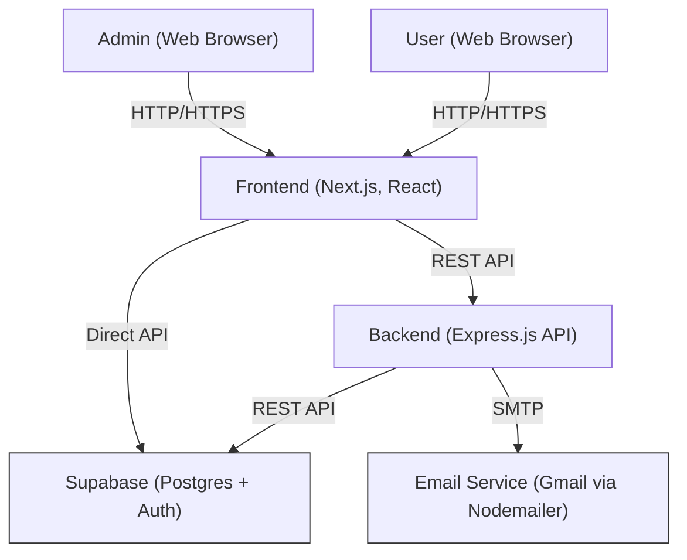

# Documentation

---

## System Architecture Diagram



---

## API Documentation

The backend exposes a RESTful API for flights, bookings, users, payments, and admin operations.

- **Base URL:** `http://localhost:4000/api`
- **OpenAPI Spec:** See [`frontend/public/openapi.json`](frontend/public/openapi.json)

### Main Endpoints
- `GET /flights` - Search flights
- `POST /bookings` - Create booking
- `GET /bookings?userId=...` - Get user bookings
- `GET /airports` - List airports
- `GET /user-profile?user_id=...` - Get user profile
- `POST /saved-payments` - Save payment method
- `GET /saved-payments?user_id=...` - Get saved payments
- `GET /admin/metrics` - Admin dashboard metrics
- `GET /admin/bookings` - Admin bookings management
- `GET /admin/flights` - Admin flights management
- `GET /admin/users` - Admin users management

> For detailed request/response schemas, authentication, and error codes, refer to the [OpenAPI spec](frontend/public/openapi.json).

---

## Setup and Deployment

### Prerequisites
- Node.js (v18+ recommended)
- Yarn (or npm)
- Docker & Docker Compose (for containerized setup)
- Supabase project (see [Supabase](https://supabase.com/))

### 1. Clone the Repository
```bash
git clone <repo-url>
cd Flight-management-system
```

### 2. Configure Environment Variables
- See `.env` examples in the [README](README.md)

### 3. Install Dependencies
```bash
cd backend && yarn install
cd ../frontend && yarn install
```

### 4. Database Setup
- Create a Supabase project and run the SQL scripts in `frontend/scripts/`

### 5. Running the Project
- **With Docker Compose:**
  ```bash
  docker-compose up --build
  ```
- **Manually (Dev Mode):**
  - Backend: `cd backend && yarn dev`
  - Frontend: `cd frontend && yarn dev`

For more details, see the [README.md](README.md).

--- 

---

## Test Coverage Report

The backend uses **Jest** for automated testing and provides detailed test coverage reports.

### Latest Coverage Summary

| File/Module         | % Stmts | % Branch | % Funcs | % Lines |
|---------------------|---------|----------|---------|---------|
| **All files**       |  70.33  |  60.57   |  100    |  70.33  |
| admin.js            |  80.24  |  56.32   |  100    |  80.24  |
| airports.js         | 100.00  | 100.00   |  100    | 100.00  |
| bookings.js         |  58.89  |  50.79   |  100    |  58.89  |
| flights.js          |  91.17  |  65.07   |  100    |  91.17  |
| logger.js           | 100.00  | 100.00   |  100    | 100.00  |
| savedPayments.js    | 100.00  | 100.00   |  100    | 100.00  |
| supabaseClient.js   | 100.00  | 100.00   |  100    | 100.00  |
| userProfile.js      | 100.00  |  92.30   |  100    | 100.00  |

- **Test Suites:** 7 passed, 7 total
- **Tests:** 90 passed, 6 skipped, 96 total
- **Snapshots:** 0
- **Time:** ~1.7s

> Some files (notably `bookings.js` and `admin.js`) have lower branch and statement coverage. Consider adding more tests for edge cases and error handling in these modules.
> 
> There are 6 skipped tests. Review and enable them for more comprehensive coverage.

### How to Generate the Coverage Report

1. Navigate to the backend directory:
   ```bash
   cd backend
   yarn test --coverage
   ```
2. After running the tests, a coverage summary will be displayed in the terminal.
3. For a detailed, interactive HTML report, open:
   - `backend/coverage/lcov-report/index.html`

### What is Covered
- All backend API endpoints (flights, bookings, users, payments, admin)
- Business logic and error handling
- Integration and unit tests for core modules

> **Note:** The frontend does not include automated test coverage by default. You can add your preferred testing tools (e.g., Jest, React Testing Library, Cypress) for frontend coverage. 